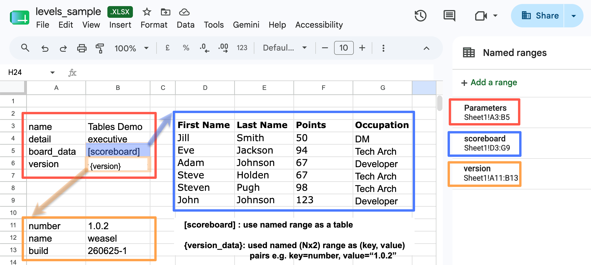

# HUBRIS: Helpful Utility to Bring Reporting Into Spreadsheets

- Sources at https://github.com/holdenweb/hubris

This project is an attempt to help organisations that insist on managing
their businesses, or major aspects thereof, using spreadsheets.
Many articles have been written on the limitations of spreadsheet technology.
If you have any doubts then look at the "The Problem with Spreadsheets"
section of this [LinkedIn
article](https://www.linkedin.com/pulse/spreadsheets-inadequate-effective-management--gjsse/).
Some large organisations are now
[providing advice](https://www.gov.uk/guidance/creating-and-sharing-spreadsheets)
— although in many cases better advice might be:
_stop using spreadsheets for that_!

Rather than try to change the way people do business (imagine "If I Ruled the
World" playing softly in the background), HUBRIS is intended to help people extract
that locked-up data more effectively, in simple and easy-to-understand ways
that don't affect existing workflows.

It lets you add data specifications to any existing spreadsheet by creating
named ranges in the spreadsheet. By default HUBRIS will look for a range
name `Parameteres`, although this can be overwritten on the command line,
as its starting point. The parameters range shoud be precisely two columns wide, and HUBRIS
treats the left-hand column as names and the right-hand column as values.
Normally, the values are used literally after extraction from the spreadsheet.
Two special value types are given special treatment.

  - `[range-name]`: the range is exported as a JSON list or, if  it's two-dimensionsl a list of row lists.
  - `{range_name}`: The range, which must be two columns wide, becomes a JSON object where the left-hand column specifies
    the names and the right-hand column specifies the values.

The parameter details are used to extract data from the spreadsheet, which is then sent to standard output as JSON.

In the example shown, the `version` key has a dict value, and in that dict the `number` key has a valiu of "1.0.2".
The version number can therefore be referenced in the JSON output as `version.number`. The output from this example is shown below.

A demonstration of the system can be found at [https://gihtub.com/holdenweb/hubris-demo](https://gihtub.com/holdenweb/hubris-demo).

This is particularly useful for audiences that have an interest in only a
limited number of features from a possibly quite large spreadsheet.
More generally, JSON is such a widely used format that spreadsheet data can
be re-used in a wide range of systems as appropriate.